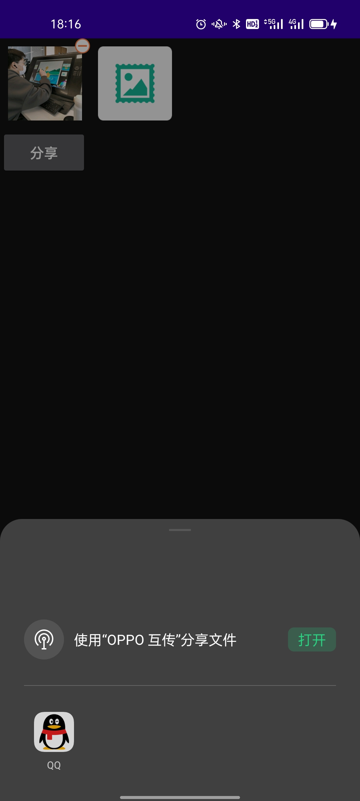

# NaviteShare
## 简介
这个是一个Android项目,用于分享图片到QQ

一般情况 下，android需要实现分享微信，朋友圈和QQ是需要去对应的开放平台注册开发者账号，拿到APPID，
下载对应的sdk才可以集成对应的分享功能，当然也可以使用目前比较好的ShareSdk 友盟等等第三方平台的集成的分享方案，这样就比较简单一点，
但是也还是需要自己去注册开发者账号的。而且现在开放平台的审核越来越严格，
有的甚至直接审核失败，这就导致APP无法集成分享的功能，好在我们可以使用android系统的机制，
使用应用之间通过intent，包名跳转和传递数据，从而可以实现跳过注册开发者账号的门槛实现分享，
亲测通过，当然也存在部分机型适配的小问题，大部分都是可以的
## 演示效果
